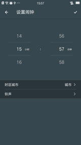
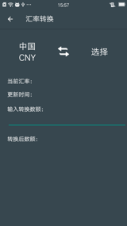
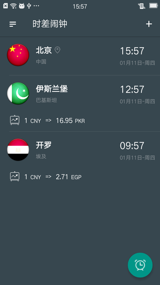
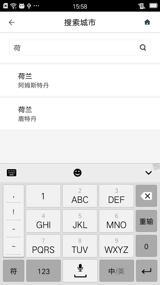

时差闹钟
================================

## About
一个学习性的应用，针对`出差、旅游、留学的人群`，提供一款高效`设置外国时间闹钟`（不用自己换算本地时间），目前并附带`汇率查询功能`。  

Fork & Star，都无尽感谢。

      

## Features
* **桌面插件**显示各国时间
* 选择目标城市**设置闹钟**
* 各国法币**汇率查询**功能
* **更新提醒**功能
* **邮件反馈**功能

## Framework
* 网络框架：volley
* 图片框架：fresco
* View框架：butterknife
* 数据库框架：greendao
* 异步框架：rxjava
* 事件框架：eventbus

## License
该应用已经发布到各大安卓市场，可以搜索“时差闹钟”，直接下载体验功能。  

如果使用到本项目代码，请Fork & Star支持一下，微薄的支持。
